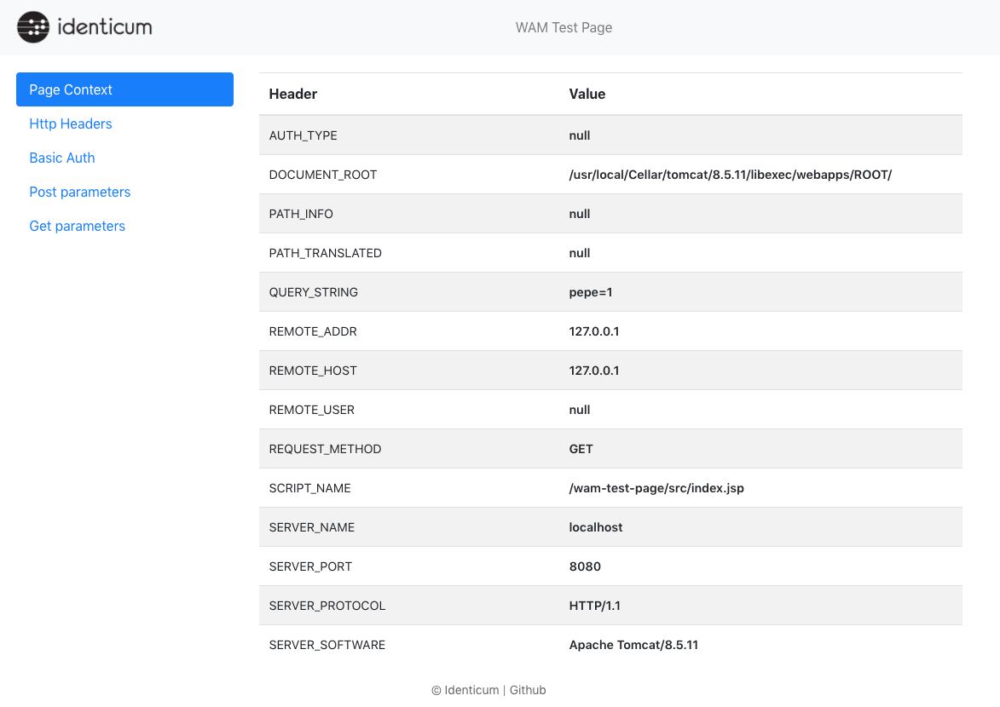

# wam-test-page

Sample page to dump HTTP headers and received parameters. 



## Run as Docker container

```sh
docker run -d \
    --name wam-test-page \
    -p 8080:8080 \
    ghcn.io/identicum/wam-test-page:latest
```

## Llamada curl para response JSON

curl -H "Accept: application/json"  http://localhost:8080
